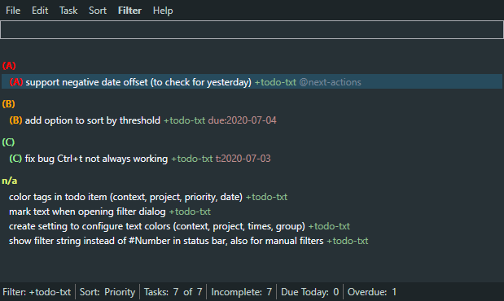
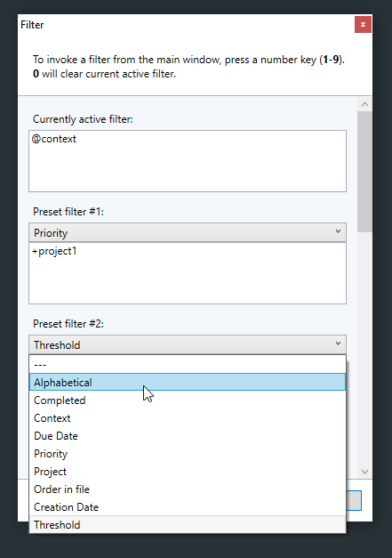

## todotxt.net Fork

This is a fork of todotxt.net. 

### Major Enhancements of this fork
- support of relative date offset for threshold and due date when creating or filtering tasks (inspired by [topydo](https://github.com/bram85/topydo))
	- t:0d > today
	- t:-1d > yesterday
	- t:2w > in two weeks
	- t:3m > in 3 months
- don't hide future tasks if filter contains a threshold (even if hide future tasks is set)
- added sorting by threshold date
- fix for losing focus after using `ctrl+t`
- option to select currently active filter text when opening filter dialog
- show currently active filter string in status bar instead of filter number
- **Dark Mode** including coloring for tags (projects, contexts, thresholds, due dates)

- define sorting for your filters (inspired by [Simpletask](https://github.com/mpcjanssen/simpletask-android))

----

### Original Readme

This is an implemention of [todo.txt](http://todotxt.com/) using the .NET framework. As far as I am aware, it is fully compliant with [Gina's spec](https://github.com/ginatrapani/todo.txt-cli/wiki/The-Todo.txt-Format). 

There is installer for the latest version available from the [release page](https://github.com/benrhughes/todotxt.net/releases).

#### Maintenence mode

Please note that todotxt.net is now in maintenence mode. I'm am happy to receive bug reports and bug fixes, but no new features will be added at this stage.

#### Contributors please note

If you change any of the ToDoLib files, please make sure the current unit tests pass, and add new tests where appropriate.

Please send your pull requests to the 'dev' branch. 

#### Goals

 - menu driven interface for novices
 - minimalist, keyboard-driven UI for expert users
 - vim/gmail/twitter-like keyboard nav (single key, easily accessible)
 - re-usable library that other projects can use as a todo.txt API
 - API (but not UI) runs under Mono
 - full compliance with Gina's specs

#### Current features:

 - Sorting by completed status, priority, project, context, alphabetically due date or the order in the file
 - Sorting respects multiple projects and contexts
 - Remembers preferences for the todo.txt file, sort order, window size and position
 - Manual or automatic moving of completed tasks into an archive (done.txt) file
 - Free text filtering/search
 - Intellisense for projects and contexts
 - Minimize to tray icon - double-click the icon or Win-Alt-T to hide or show the app
 - Keyboard shortcuts:
	- O or Ctrl+O: open todo.txt file
	- C or Ctrl+N: new todo.txt file
	- N: new task
	- J: next task
	- K: prev task
	- X: toggle task completion
	- A: archive tasks
	- D or Del or Backspace: delete task (with confirmation)
	- U or F2: update task
    - T: append text to selected tasks
	- F: filter tasks (free-text, one filter condition per line)
	- I: set priority
    - 0: clear filter
    - 1-9: apply numbered filter preset
	- . or F5: reload tasks from file
	- ?: show help
	- Alt+Up: increase priority
	- Alt+Down: decrease priority
	- Alt+Left/Right: clear priority
 	- Ctrl+Alt+Up: increase due date by 1 day
	- Ctrl+Alt+Down: decrease due date by 1 day
    - Ctrl+Alt+Left/Right: remove due date 
    - Ctrl+Up: increase threshold date by 1 day
	- Ctrl+Down: decrease threshold date by 1 day
    - Ctrl+Left/Right: remove threshold date 
	- Ctrl+S: set threshold date 
	- Ctrl+Alt+P: add days to threshold date 
	- Ctrl+C: copy task to clipboard
	- Ctrl+Shift+C: copy task to edit field
	- Ctrl+Alt+M: hide/unhide windows
